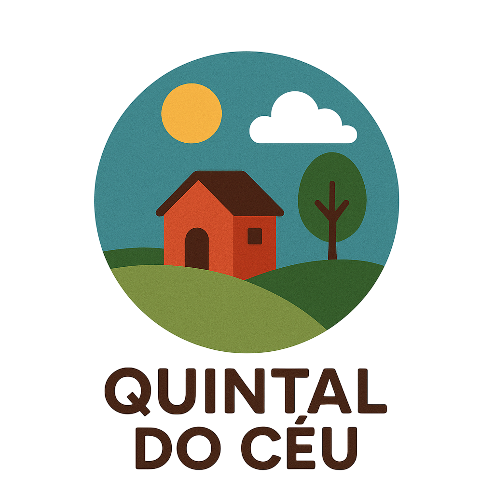

# Quintal do Céu



## Sobre

A **Quintal do Céu** é uma organização não governamental dedicada a transformar vidas através da compaixão e ação social. Nossa missão é promover transformação social através de projetos que atendem comunidades em situação de vulnerabilidade, conectando voluntários engajados a causas que geram impacto real e duradouro.

### Nossa Missão
Promover transformação social através de projetos que atendem comunidades em situação de vulnerabilidade, conectando voluntários engajados a causas que geram impacto real e duradouro.

### Nossa Visão
Ser reconhecida como uma organização referência em inovação social, criando uma rede colaborativa que amplifica o potencial transformador de cada pessoa e comunidade.

### Nossos Valores
- **Transparência:** Prestação de contas clara e acessível
- **Inclusão:** Oportunidades para todos, sem distinção
- **Sustentabilidade:** Soluções que perduram no tempo
- **Colaboração:** Trabalho em rede e parcerias estratégicas

### Projetos Principais

#### 🎓 Educação para Todos
Oferecemos reforço escolar, alfabetização de adultos e atividades complementares para crianças e jovens de comunidades em vulnerabilidade social.

#### 🍎 Alimentação Solidária
Distribuição semanal de cestas básicas, refeições prontas e programa de hortas comunitárias para combater a insegurança alimentar.

#### 🌱 Verde Urbano
Revitalização de espaços urbanos através de plantio de árvores, criação de hortas comunitárias e educação ambiental.

#### 🏥 Saúde em Movimento
Atendimento médico básico, campanhas de vacinação e palestras de prevenção em comunidades com acesso limitado aos serviços de saúde.

#### 👨‍💼 Capacitação Profissional
Cursos de capacitação profissional e empreendedorismo para jovens e adultos, promovendo autonomia financeira.

#### 👴 Apoio ao Idoso
Atividades recreativas, acompanhamento médico domiciliar e suporte emocional para idosos em situação de vulnerabilidade.

### Impacto em Números
- **5.420** vidas impactadas
- **127** voluntários ativos
- **23** projetos ativos
- **8** anos de atuação

## Desenvolvimento

### Visão Geral Técnica

Este projeto é um site institucional desenvolvido para a ONG Quintal do Céu, construído com tecnologias web modernas e focado em acessibilidade, performance e experiência do usuário. O projeto foi completamente otimizado seguindo as melhores práticas de HTML5 semântico e padrões WCAG 2.1 AA.

### Stack Tecnológico

- **Frontend:** HTML5, CSS3, JavaScript (ES6+)
- **Build Tool:** Vite 7.1.7
- **Arquitetura:** Multi-page Application com estrutura modular
- **Estilização:** CSS modular com foco em responsividade e acessibilidade
- **Validação:** Context7 MCP para documentação e validação HTML5

### Estrutura do Projeto

```
quintal-do-ceu/
├── index.html              # Página inicial (otimizada)
├── cadastro.html           # Formulário de cadastro de voluntários
├── projetos.html           # Catálogo de projetos sociais (otimizado)
├── src/
│   ├── main.js            # JavaScript principal com funcionalidades interativas
│   ├── styles/
│   │   ├── styles.css     # Aggregador de módulos CSS
│   │   ├── variables.css  # Variáveis CSS customizadas
│   │   ├── reset.css      # Reset e normalização
│   │   ├── layout.css     # Layout e estrutura
│   │   ├── components.css # Componentes reutilizáveis
│   │   ├── forms.css      # Estilos de formulários
│   │   └── responsive.css # Media queries e responsividade
│   └── assets/
│       ├── icons/         # Ícones e logos
│       └── images/        # Imagens dos projetos (WebP otimizadas)
├── public/                # Assets públicos
└── package.json           # Configurações do projeto
```

### Características Técnicas

#### ✅ Acessibilidade (WCAG 2.1 AA)
- **Skip Links:** Navegação por teclado otimizada
- **ARIA Labels:** Implementação completa de roles e labels
- **Navegação Semântica:** Estrutura de menubar com menuitems
- **Breadcrumbs:** Navegação estrutural implementada
- **Formulários Acessíveis:** Labels, validação e feedback claro
- **Contraste:** Adequado para todos os usuários
- **Screen Readers:** Compatibilidade total com leitores de tela

#### ✅ Semântica HTML5
- **Estrutura Semântica:** Header, main, section, article, footer
- **Hierarquia de Cabeçalhos:** H1-H6 corretamente implementados
- **Listas Semânticas:** Role="list" e role="listitem" para grids
- **Meta Tags:** SEO completo com Open Graph e Schema.org
- **Validação:** HTML5 válido sem erros de linter

#### ✅ Responsividade
- **Mobile-First:** Design adaptativo desde dispositivos móveis
- **Breakpoints:** Sistema de breakpoints flexível
- **Imagens Otimizadas:** WebP com lazy loading
- **Layout Flexível:** Grid system responsivo
- **Tipografia:** Escalas tipográficas adaptativas

#### ✅ Performance
- **Lazy Loading:** Imagens carregadas sob demanda
- **Otimização de Assets:** Build otimizado com Vite
- **CSS Modular:** Carregamento eficiente de estilos
- **JavaScript Otimizado:** ES6+ com tree shaking
- **Meta Tags:** Otimização para motores de busca

#### ✅ Funcionalidades Interativas

**Página Inicial (index.html):**
- Seção hero com call-to-action
- Apresentação da organização
- Estatísticas de impacto animadas
- Projetos em destaque com filtros
- Formas de doação com validação
- Informações de contato completas
- Newsletter com validação HTML5

**Cadastro de Voluntários (cadastro.html):**
- Formulário completo com validação
- Campos para dados pessoais e endereço
- Seleção de áreas de interesse
- FAQ integrado
- Processo de cadastro guiado

**Catálogo de Projetos (projetos.html):**
- **Renderização Dinâmica:** Projetos carregados via JavaScript
- **Sistema de Filtros:** Categorização interativa
- **Navegação por Passos:** Processo de voluntariado explicado
- **Estatísticas Detalhadas:** Por projeto com animações
- **Formas de Contribuição:** Específicas por projeto
- **Breadcrumbs:** Navegação estrutural

### Melhorias Implementadas

#### 🚀 Otimizações de Acessibilidade
- ✅ Skip links em todas as páginas
- ✅ Navegação ARIA padronizada
- ✅ Breadcrumbs de navegação
- ✅ Formulários com validação HTML5
- ✅ Botões com aria-labels descritivos
- ✅ Grid de projetos com semântica adequada

#### 🎨 Arquitetura CSS Modular
- ✅ Sistema de módulos CSS organizados
- ✅ Variáveis CSS customizadas
- ✅ Componentes reutilizáveis
- ✅ Reset e normalização
- ✅ Responsividade otimizada

#### 📱 Experiência do Usuário
- ✅ Navegação consistente entre páginas
- ✅ Processo de voluntariado interativo
- ✅ Filtros de projetos funcionais
- ✅ Formulários de doação otimizados
- ✅ Links sociais completos

### Scripts Disponíveis

```bash
# Desenvolvimento
npm run dev

# Build para produção
npm run build

# Preview do build
npm run preview
```

### Dependências

- **Vite:** Ferramenta de build moderna e rápida
- **Node.js:** Ambiente de execução JavaScript

### Configuração de Desenvolvimento

1. Clone o repositório
2. Instale as dependências: `npm install`
3. Execute o servidor de desenvolvimento: `npm run dev`
4. Acesse `http://localhost:5173` no navegador

### Estrutura de Dados

O projeto utiliza dados estáticos organizados em:
- Projetos sociais com categorias, estatísticas e necessidades
- Informações de contato e localização
- Configurações de doação e voluntariado
- Metadados SEO e Open Graph
- Schema.org markup para SEO estruturado

### Validação e Qualidade

#### ✅ Validação HTML5
- **Context7 MCP:** Documentação e validação semântica
- **Linter:** Zero erros de validação
- **Estrutura Semântica:** HTML5 válido e bem estruturado
- **Acessibilidade:** Conformidade WCAG 2.1 AA

#### ✅ SEO Otimizado
- **Meta Tags:** Completas para cada página
- **Open Graph:** Para redes sociais
- **Schema.org:** Markup estruturado
- **Canonical URLs:** Para evitar conteúdo duplicado
- **Robots:** Configuração para indexação

### Considerações de Segurança

- **Formulários:** Validação client-side e server-side
- **Links Externos:** rel="noopener" para segurança
- **Sanitização:** Inputs validados e sanitizados
- **HTTPS:** Preparado para SSL/TLS

### Próximos Passos Sugeridos

#### 🔄 Funcionalidades Avançadas
- [ ] Sistema de backend para formulários
- [ ] CMS para gerenciamento de conteúdo
- [ ] Integração com APIs de pagamento
- [ ] Dashboard administrativo
- [ ] Sistema de notificações push
- [ ] Relatórios de impacto automatizados

#### 🎯 Melhorias de UX
- [ ] PWA (Progressive Web App)
- [ ] Modo escuro/claro
- [ ] Internacionalização (i18n)
- [ ] Sistema de busca avançada
- [ ] Chat online para suporte

#### 📊 Analytics e Monitoramento
- [ ] Google Analytics 4
- [ ] Hotjar para análise de comportamento
- [ ] Core Web Vitals monitoring
- [ ] A/B testing para conversão

### Contribuição

Para contribuir com o projeto:

1. Fork o repositório
2. Crie uma branch para sua feature (`git checkout -b feature/nova-funcionalidade`)
3. Commit suas mudanças (`git commit -am 'Adiciona nova funcionalidade'`)
4. Push para a branch (`git push origin feature/nova-funcionalidade`)
5. Abra um Pull Request

### Licença

Este projeto está sob a licença MIT. Veja o arquivo `LICENSE` para mais detalhes.

---

**Quintal do Céu** - Transformando vidas através da compaixão e ação social.

*CNPJ: 12.345.678/0001-90 | contato@quintal-do-ceu.org*

### Contato

- **Website:** [quintal-do-ceu.org](https://quintal-do-ceu.org)
- **Email:** contato@quintal-do-ceu.org
- **Telefone:** (11) 2345-6789
- **WhatsApp:** (11) 98765-4321
- **Endereço:** Rua da Esperança, 123 - Centro, São Paulo, SP - CEP: 01234-567

### Redes Sociais

- [Facebook](https://facebook.com/quintal-do-ceu)
- [Instagram](https://instagram.com/quintal-do-ceu)
- [LinkedIn](https://linkedin.com/company/quintal-do-ceu)